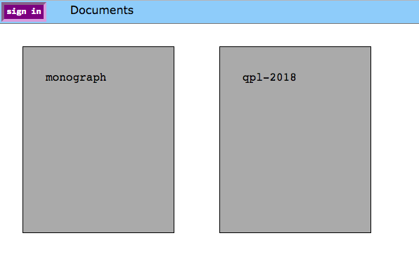
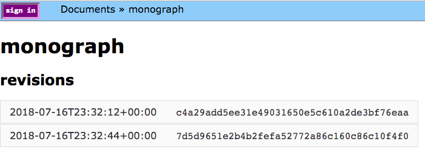
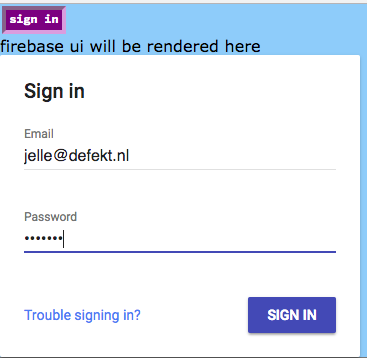
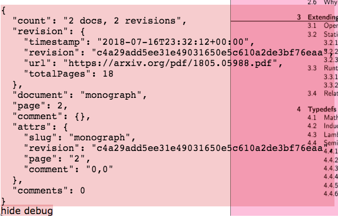
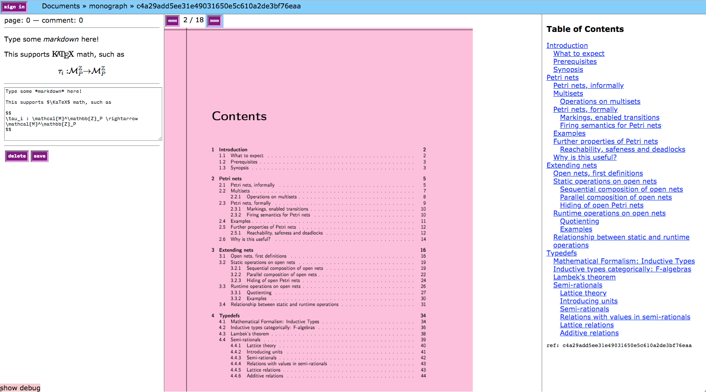

# Online annotation tool for PDFs

### Supports Multiple Documents

### Supports Multiple Revisions

### Firebase E-mail Authentication

### Debugging Window

### Annotation Tool

# Usage

## Installation

Git clone and then

        npm install

## Run server

Start auto reloading development server

        npm run dev
